---

title: "算法笔记|二叉堆，二项堆和斐波那契堆（原理篇）"
subtitle: ""
date: 2023-11-15T20:43:01+08:00
lastmod: 2023-11-22T14:03:16+08:00
draft: false
author: ""
authorLink: ""
description: ""

tags: [Algorithm]
categories: [Algorithm]

hiddenFromHomePage: false
hiddenFromSearch: false

featuredImage: ""
featuredImagePreview: ""

image: "images/image-feature.png"

toc:
  enable: true
math: true
lightgallery: false
license: ""
---

<!--more-->

## 优先队列

### 动机

某些情况下，我们需要频繁地**动态**地取出一个集合S中的最小元素/最大元素。

这里**动态**指我们需要在集合S上执行插入/删除/更改键值操作。

问题在于如何组织数据结构使这些操作更高效。

### 操作定义

以最小优先队列为例：

| 方法名               | 描述                                         |
| -------------------- | -------------------------------------------- |
| MakeHeap()           | 建立一个堆H                                  |
| Insert(H, x)         | 在堆H中插入元素x                             |
| ExtractMin(H)        | 提取堆H中的最小元素                          |
| DecreaseKey(H, x, k) | 减小堆中元素x的键值为k                       |
| Union(H1 , H2 )      | 返回一个新堆包含H1和H2的所有元素，销毁输入堆 |

### 应用举例

- Dijkstra单源最短路算法：需要`ExtractMin`
- Prim最小生成树算法：需要`ExtractMin`与`DecreaseKey`
- Why we need Union?

## 数组/链表实现

我们可以用数组或链表快速实现一个简单版本的优先队列。

由于本篇偏向理论分析，因此更在意数据结构的**逻辑结构**而非物理结构。对以下两种实现方式而言，可以认为数组的逻辑结构和链表相同（实际上二者复杂度分析也相同），因此都用链表代替。

### 无序链表实现

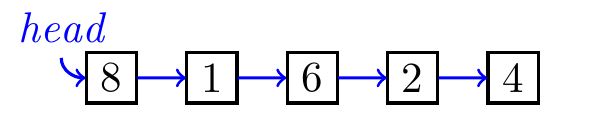

每次都在首部插入新元素；提取最小值时，遍历链表找到最小值并更改链表指针将其从链表中删除。

（数组版本）每次在尾部插入新元素；提取最小值时，遍历数组找到最小值并将其与尾部元素交换位置，减小长度计数。

复杂度：

- 插入操作：$O(1)$
- 提取最小值：$O(n)$

### 有序链表实现

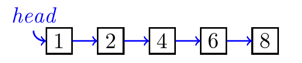

插入新元素时，遍历链表至第一个大于其的元素位置处，在此之前插入；提取最小值直接返回首部，并将其删除（更改头指针）。

（数组版本）倒序维护数组大小，插入新元素时，遍历链表至第一个小于其的元素位置处，在此之前插入，后续元素后移；提取最小值时直接返回尾部，并将其删除（减小长度计数）。

复杂度：

- 插入操作：$O(n)$
- 提取最小值：$O(1)$

### 问题

是否存在使得插入和提取最小值时间复杂度更均衡/更优的数据结构？

## 二叉堆

观察有序链表实现，插入操作实际上每次都在进行插入排序以维持整个链表的有序，然而这属于工作过头了，我们只需要维护一个最小值。

- 有序链表的每个指针指向的元素都大于等于自身，数据结构限制过于严格，因此需要**放松限制**。
- 但限制不能**过分放松**，否则就会像无序链表那样，元素间没有任何限制，导致提取操作复杂度上升。

二叉堆：

- 逻辑结构：一颗二叉树，且父结点小于子结点。所有结点除最后一层外按照完全二叉树排列。

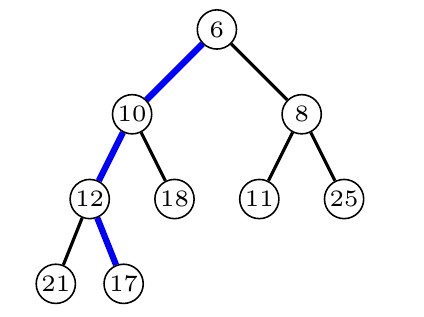

- 物理结构：为了便于随机读取以及减少指针开销。结点以完全二叉树编号为下标放入数组中。

  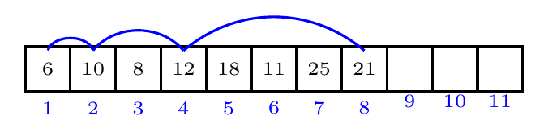

  因此对结点$i$ ，左子结点下标为$2i$，右子结点下标为$2(i + 1)$，父结点下标为$ (i-1)/2$（向下取整）。下标越界时，表示结点不存在。

操作：

- 插入：将新元素置于二叉堆尾部，依次向上调整，使得最小堆性质（父结点小于子结点）保持。由于二叉堆高为$log_2n$（$n$为元素个数），因此时间复杂度为$O(logn)$。

- 提取最小值：将堆顶元素与堆尾元素交换，减小堆数组长度计数，从根结点开始依次向下调整，使得最小堆性质保持。时间复杂度为$O(logn)$。

- `DecreaseKey(x, k)`：将下标`x`处元素值降低为`k`。从该元素开始依次向上调整。时间复杂度为$O(logn)$。

- 建堆：

  - 通过建空堆依次入堆。时间复杂度$O(nlogn)$。

  - 通过"遍历堆化"实现。将所有元素原封不动地入堆，随后调整堆结构。

    - 方法：按照完全二叉树编号从尾结点开始向根结点依次调用“向下调整”。

    - 时间复杂度：将堆补充为完全二叉树，不影响复杂度计算。设层高为$d = log_2n$。从上到下依次为第0...d层。对第i层，操作总次数为$2^i*(d-i)$​。因此总操作数
      $$
      T(n)=2^0d+2^1(d-1)+2^2(d-2)...+2^{d-1}
      $$

      $$
      2T(n)=2^1d+2^2(d-1)+...+2^{d}
      $$

      故
      $$
      T(n)=2^1+2^2+...+2^d -d=2\frac{1-2^d}{1-2}-d=2^{d+1}-d-2=O(2^{d+1})=O(n)
      $$
  
- 合并：将两个堆的数据组成一个堆，再遍历堆化。$O(n)$。

至此，我们得到了插入，提取，改键均为$O(logn)$，且合并为$O(n)$的堆。实现简单且复杂度不错。

### 问题

如果想进一步降低**合并**的复杂度，该怎样调整数据结构？

## 二项式堆

观察二叉堆的逻辑结构，我们发现只允许**一棵树**存在这一限制。因此在两个堆合并时，需要拆散两颗树合并为一颗。如果允许多棵树存在，逻辑结构不是一棵树而是**森林**。合并时无需破坏原有堆的结构。

- 放松限制：一棵树 -> 允许森林
- 不要过分放松：**同类型**的树只存在一颗。

综上，既然允许多棵树存在，插入操作就变成了**合并**操作，即合并一颗只含根结点的树，直接将其插入森林中即可；由于同类型的树只能有一颗，我们需要合并**同类型**的树，合并后的树也应该属于**某个类型**。

### 二项树

定义：$B_k$为二项式树，定义$k$为$B_k$的度数。

- $B_0$只含有一个结点
- 两个$B_k$可以合并为$B_{k+1}$

>  这里合并操作指将$B_k$作为另一$B_k$的根结点的儿子插入。

这样的定义使二项树有一些有趣的性质：

- $B_k$树层高为$k$
- $B_{k}$树的每个子结点分别为$B_0,B_1,...,B_{k-1}$ （$B_k$树的第$i$个子结点的度为$i-1$）
- $B_k$树的每层结点个数正好是$k$的二项式系数（$(a+b)^k$）（命名来源）
- $|B_k|=2^k$

### 二项堆

定义：二项堆为二项树组成的森林

- 其中每个度数的二项树只有一颗
- 对于二项堆中的每颗二项树，满足最小堆性质

由此，当二项堆里有相同类型的二项树需要合并时，取根结点最小的树的根结点作为父结点，将另一棵树作为其儿子插入。

二叉堆二项树根结点用双向链表连接，指针指向最小的根结点。

二项堆也有一些有趣的性质：

- 对于规模为$n$的二项堆，其二项树的组合是**确定**的。二项堆含有$B_i$当且仅当$b_i=1$，其中$(b_kb_{k-1}...b_0)_2=n$。
- 二项堆最多含有$log_2n$（向下取整）颗二项树
- 二项堆的层高不超过$log_2n$（向下取整）

操作：

- 插入：合并一颗$B_0$树。最好情况下$O(1)$，最坏情况下$O(logn)$，均摊复杂度为$O(1)$。这是什么？别急
- 提取最小值：将最小根结点取出，将该二项树拆为其所有子树，合并相同类型的二项树。$O(logn)$。
- 合并：复杂度$O(logn)$，均摊复杂度$O(1)$。
- 减小键值：在某颗二项树上向上调整。$O(logn)$。

### 均摊分析

为什么要均摊分析？在分析插入/合并/提取最小值时，我们总考虑工作量的上限，即最坏情况，推出复杂度均为$O(logn)$。但是这三个操作复杂度在时间上具有继承性，如果做了一次工作量较大的操作，随后许多次操作都只需要很小的工作量。这种情况下可以引入**势能分析**。

#### 插入

伪代码：

```
Insert(x) {
  Creat a B0 tree for x;
  Change the pointer to the min root;
    while (there are two Bk tree for some k) {
      Link them into one Bk+1 tree;
      Change the pointer to the min root;
  }
}
```

一次插入操作需要消耗$1+w$时间，$w=\\#while$  是`while`语句执行的数量，$\\#$表示`number of`。

引入势函数$\Phi=\\#tree$，即二叉堆中树的数量。当进行一次插入操作后，势函数可以分为上升的部分和下降的部分。

- 上升：$1$
- 下降：$w$，即树减少的数量

因此一次插入操作需要$1+decrease\ in\ \Phi$。而由于$\Phi>=0$，故$all\ decrease\ in\ \Phi <= all\ increase\ in\ \Phi$。这为我们统计一系列操作提供了方便。

可以看到，当分析合并时，伪代码与插入只有第二行的区别，一次合并操作需要的时间也是$1+decrease\ in\ \Phi$。

#### 提取最小值

伪代码：

```
ExtractMin(H) {
  Remove the min node and insert its children to the root list;
  Change the pointer to the min node;
  while (there are two Bk tree for some k) {
    Link them into one Bk+1 tree;
    Change the pointer to the min root;
  }
}
```

一次操作需要消耗$d+w$，$w=\\#while$，$d$为去除根结点的树的度（也是其子树数量）。

我们用同样的势函数$\Phi=\\#tree$。进行一次操作，势函数既有上升的部分也有下降的部分。

- 上升：$d$
- 下降：$w$

因此一次操作需要$d+decrease\ in\ \Phi$。其中$d<=log_2n$。

#### 分析

若对一个二叉堆做了$a$次插入操作和$b$次提取最小值操作，总消耗的时间

$$
\begin{align\*}
T(a,b)&= a(1+decrease\ in\ \Phi)+b(d+decrease\ in\ \Phi) \\\\\\
		&\le a(1+increase\ in\ \Phi)+b(d+increase\ in\ \Phi) \\\\\\
		&=a+bd+all\ increase\ in\ \Phi \\\\\\
		&=a+bd+a+bd=2a+2bd \\\\\\
		&\le 2a+2blogn
\end{align\*}
$$
由于$n$与$m$无关，因此插入操作的均摊复杂度为$O(\frac{T(a)}{a})=O(1)$，提取最小值的操作的均摊复杂度为$O(\frac{T(b)}{b})=O(logn)$。合并操作均摊复杂度与插入操作相同，为$O(1)$。

### 问题

对比二叉堆，我们成功地将合并操作的复杂度降低为$O(1)$（均摊）。如果进一步考虑，如何降低**减小键值**的复杂度呢？

## 斐波那契堆

对于减小键值操作，无论是二叉堆还是二项堆，都避免不了对堆进行调整的操作。为了降低复杂度，能否进行操作后，不进行或推迟调整操作？

斐波那契堆在二项堆的基础上：

- **放松限制**，允许同类型的二项树共存；同时在减小键值操作后，并不调整堆而是直接将该结点及其子树摘下放入根结点列表中，同时给该结点的父结点打上标记，已表明该父节点“失去”过一个结点。（1）

- 注意到该限制不是**完全放松**的，对每颗二项树而言，非根结点最多失去一个结点。（2）

> “摘下”操作相当于取消了原来的堆调整过程，将其推迟到堆做合并时。减小键值对应着摘下结点。
>
> 当已被标记的结点的子结点被摘下后，该结点应取消标记并也被摘下，递归地向父结点进行直至没有标记。
>
> 根结点不允许失去结点 -> 便于统计树的度数 。

注意到由于条件（1）的存在，插入和合并都只需向根结点列表中添加新的树即可。但堆总要做出调整，何时？

答案是不得不调整时，即**提取最小值**后，此时无论如何都要进行合并操作了，否则根结点列表数量将膨胀。

合并操作是合并**相同度数**的树。树的度数等于根结点的子结点数目。

操作：

- 插入：合并一颗$B_0$树。复杂度$O(1)$。
- 提取最小值：将最小根结点取出，将拆为其所有子树并插入根结点列表。最坏&均摊$O(logn)$。为什么？
- 合并：复杂度$O(1)$。
- 减小键值：均摊复杂度$O(1)$。

### 均摊分析

#### 提取最小值

伪代码：

```
ExtractMin() {
  Remove the min node and insert its children to the root list;
  Change the pointer to the min node;
  while (there are two roots u and v of the same degree) {
	  Consolidate the two trees together;
	  Change the pointer to the min root;
  }
}
```

与二叉堆的操作相同，但这里我们使用新的势函数$\Phi=\\#tree+2\\#mark$，$\\#mark$为被标记的非根结点数量。 why?

一次提取最小值操作带来的势函数变化为：

- 上升（静态）：$d$（移除结点的度）
- 下降（动态）：$w$

一次操作需要$d+decrease\ in\ \Phi$，$d$为根结点的度。

> 注意到由于树会被摘下结点，因此$d$有可能大于$log_2n$。
>
> 想象单颗二项树的情景，有$d=log_2n$，由于$n$减小，故$d>log_2n$。扩展到堆也可能成立。
>
> 因此均摊操作复杂度取决于$d$的上界，后续会证明$d$的上界。思路：找到二项树对应的结点数最小的树，即斐波那契树的结点数目。

#### 减小键值

再回想一下减小键值的操作：

> 减小键值对应着摘下结点（若堆序被破坏）。
>
> 当已被标记的结点的子结点被摘下后，该结点应取消标记并也被摘下，递归地向父结点进行直至没有标记。
>
> 根结点不能失去结点：对父结点为根结点的操作特殊处理。

伪代码：

```
DecreaseKey(x, k) {
  key(x) = k;
  if (heap order is violated) {
    p = x->parent;
    if (p is root node) {
      Swap key between p and x;
      return;
    }
    Cut the subtree rooted at x, and insert it into the root list;
    Change the pointer to the min root node; 
    while (p is marked) {
      Cut the subtree rooted at p, and insert it into the root list;
      Change the pointer to the min root node;
      Unmark p;
      p = p->parent;
    }
    Mark p;
  }
}
```

为了复杂度计算方便，暂时先不考虑`x`的父结点为根结点的情况。由伪代码可以得到，一次操作消耗的时间为$1+w,w=\\#while$。

考察势函数$\Phi=\\#tree+2\\#mark$，一次减小键值操作带来的势函数变化为：

- 上升（静态）：$1+2=3$
- 下降（动态）：$（-1+2）w=w$

故一次操作消耗的时间为$1+decrease\ in\ \Phi$。

当`x`的父结点为根结点时也符合上式。

#### 插入

$\Phi$上升$1$，下降$0$。

一次操作消耗的时间为$1$。

#### 分析

考虑一段操作序列：$r$次插入，$s$次提取最小值，$t$次减小键值。

总的运行时间最大为：$r+sd_{max}+t+total\ decrease\ in\ \Phi$。

注意到：$(total\ decrease\ in\ \Phi) \le (total\ increase\ in\ \Phi) = r+sd_{max}+3t$。

因此总的运行时间最大为：$2r+2sd_{max}+4t$。

因此插入的均摊复杂度为$O(1)$，减小键值的均摊复杂度为$O(1)$，提取最小值的均摊复杂度为$O(d_{max})$。

#### $d_{max}$限界分析

$d_{max}$为$d$的上界，限界即确定$d_{max}$与堆结点数目$n$的关系。

考虑一颗$B_k$树，则其度$d=log_2n$，若堆中有多颗$B$树，相当于$n$增加，则其中一颗树的度$d<log_2n$。因此为了确定$d$的上界，堆中树越少越好，即只有一颗。

考虑一颗$B_k$树，其度$d=log_2n$，若从其上摘下结点（减小键值操作），对单颗树来说，相当于$n$减小，则$d>log_2n$，当$n$最小时，此时取得最大的$d$。也可以考虑为$n$不变时，这种构成堆的方式（即单颗树且丢失最多的结点）可使$d$最大，即取到$d_{max}$。

于是我们开始寻找各个度对应的最少结点树，不妨记其为$F_k$，$k$为度数：

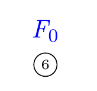

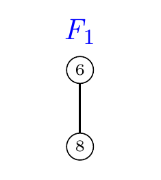

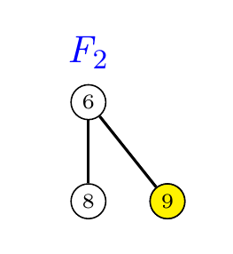

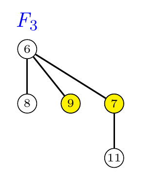

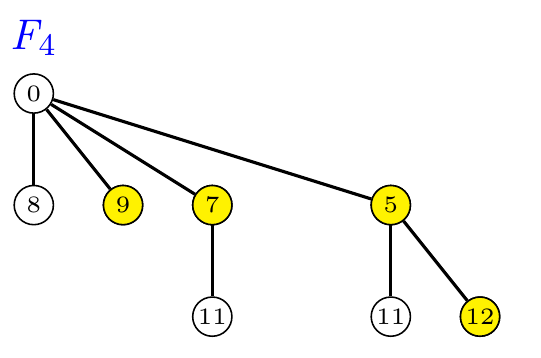

回想二项树$B_{k+1}$由两颗$B_k$树构成：

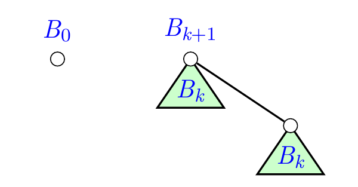

$F_{k+1}$树由$F_{k}$和$F_{k-1}$构成：

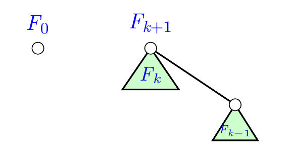

尽管$|F_k|<|B_k|$，但不会小太多。$|F_k|\ge1.618^k$。

对于斐波那契数列：
$$
f_k=f_{k-1}+f_{k-2},f_0=0,f_1=1
$$
注意到$|F_k|=f_{k+2}$，因为$|F_0|=f_2=1, |F_1|=f_3=2，|F_{k}|=|F_{k-1}|+|F_{k-2}|$。

由斐波那契通项性质$f_{k+2} \ge \phi^k, \phi=\frac{1+\sqrt{5}}{2}=1.618...$。

考虑一个斐波那契堆含有$n$个结点，$T$为其中一颗树，其根结点度为$d$。

则$n\ge|T|\ge|F_d|=f_{d+2}\ge\phi^d$。

因此$d\le log_{\phi}n$。故$O(d_{max})=O(log_{\phi}n)=O(logn)$。

因此提取最小值的均摊复杂度为$O(logn)$。
