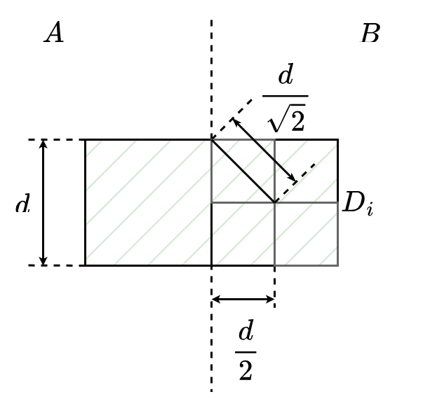

<!--more-->

## Q1


算法描述：记两个数据库中的数据分别构成集合$A$和$B$。

取$A$中第$i$小的元素$a_i$，将$A$分成$A_L$ 和$A_R$两部分，其中

 $A_L= \lbrace a\mid a\in A, a<=a_i \rbrace$ ，$A_R= \lbrace a\mid a\in A, a>a_i \rbrace$。

特别地，当$i=0$时，设$A_L=\emptyset$，$A_R=A$。

同样，取$B$中第$j$小的元素$b_j$，将$B$分成$B_L$ 和$B_R$两部分，其中

 $B_L= \lbrace b\mid b\in B, b<=b_j \rbrace$，$B_R= \lbrace b \mid b\in B, b>b_j \rbrace$。

特别地，当$j=0$时，设$B_L=\emptyset$，$B_R=B$。

记$C_L=A_L\cup B_L$，$C_R=A_R\cup B_R$。

当$|C_L|=|C_R|=n$ 且 $max(C_L) <= min(C_R)$时，题目所求的中位数即为$(max(C_L)+min(C_R))/2$。

由$|C_L|=|C_R|=n$ 可得$i+j=n$，而$max(C_L)=max(a_{i},b_j)$，$min(C_R)=min(a_{i+1}, b_{j+1})$。算法只需要从$0$到$n$枚举$i$，当满足$max(a_{i},b_j)<=min(a_{i+1}, b_{j+1})$条件时即可得到中位数。

采用二分法来枚举$i$。设$i_{min}=0$，$i_{max}=n$，令$i=(i_{min}+i_{max})/2$。

若$a_i<=b_{j+1}$且$b_j<=a_{i+1}$，算法结束，返回中位数为$(max(a_{i},b_j)+min(a_{i+1}, b_{j+1}))/2$；

若$a_i>=b_{j+1}$且$b_j<=a_{i+1}$，说明需要减小$i$，于是令$i_{max}=i-1$，继续二分$i$进行枚举；

若$a_i<=b_{j+1}$且$b_j>=a_{i+1}$，说明需要减小$j$，即增大$i$，于是令$i_{min}=i+1$，继续二分。

当$a_i>=b_{j+1}$时一定有$b_j<=a_{i+1}$，若当$a_i>=b_{j+1}$时$b_j>=a_{i+1}$，则有$a_i>=b_{j+1}>=b_{j}>=a_{i+1}$，与$a_{i}<=a_{i+1}$相矛盾。同理可证当$b_j>=a_{i+1}$时一定有$a_i<=b_{j+1}$，因此上述三种情况可以涵盖完毕。

上述算法的伪代码如下：

```C
GetMedian(A, B, n) {
    left = 0, right = n;
    while(left <= right) {
        i = (left + right) / 2;
        j = n - i;
        if(i == 0)
            return (B[j] + A[i+1]) / 2; 
        if(i == n) 
            return (A[i] + B[j+1]) / 2; 
        if(A[i] <= B[j+1] && B[j] <= A[i+1])
            return (max(A[i], B[j]) + min(B[j+1], A[i+1])) / 2;
        if(A[i] >= B[j+1]) {
            left = i - 1;
            continue;
        }
        if(B[j] >= A[i+1]) {
            right = i + 1;
            continue;
        }
    }
}
```

其中将对数组A，B的下标访问操作视作对数据库的一次查询操作。

可以看到，每轮循环最多对数据库进行4次查询操作（假设重复查询存在缓存）则有时间复杂度$T(n)=T(n/2)+4$，由主定理可得$T(n)=O(logn)$。


## Q2

### (a)

暴力算法：对每两个点计算距离，若距离小于当前最小值，则更新最小值。

伪代码：

```C
minDist(P, n) { // P为点集，n为点的数量
    min_d = INF;
    for(i = 0; i < n; ++i) {
        for(j = i + 1; j < n; ++j) {
            计算P[i],P[j]两点的距离d;
            if(d < min_d) min_d = d;
        }
    }
    return min_d;
}
```

对于计算两点间距离的操作，算法共进行$n(n-1)/2$次，因此算法的时间复杂度为$O(n^2)$。

### (b)

算法描述：

设点集为$P$，首先将$P$中所有点按照以$x$坐标为第一关键字，$y$坐标为第二关键字从小到大进行排序。以中间点$p_m$的序号将点集分为两个集合$A$，$B$。对$A$和$B$分别调用本算法，得到点集$A$的结果$d_1$和点集$B$的结果$d_2$。

令$d=min(d_1, d_2)$。设集合$C=\lbrace p_i\mid p_i\in P, |p_i.x-p_m.x|<=d\rbrace$，集合$C$中可能存在距离小于$d$且分别位于$A$和$B$的两点，因此求出集合$C$上的最短距离$d_c$，即可得到最短距离$d_{min}=min(d_c, d)。$

对于集合$C$的任意一点$p_i$，设集合$D_i=\{p_j\mid p_j\in C, p_i.y<=p_j.y\}$，求出$p_i$与$p_j$的距离并更新最短距离，即可求出点集$C$上的最短距离。

将集合$C$按照$y$坐标由小到大排序，则集合$D_i$中的点为$p_i$的相邻几个点。可以设置集合$T=\empty$，从大到小枚举$p_i$，并从大到小枚举$p_j\in T$，枚举$p_j$过程中保证$p_j.y < p_i.y + d$，计算$p_i$与$p_j$间的距离并更新最小值，随后将$p_i$加入集合$T$，重复循环。可以看到在枚举过程中始终有$D_i \subseteq T$，且枚举$p_j$的集合恰好等于$D_i$。该算法保证没有多余的循环出现。

算法的复杂度取决于合并阶段求集合$C$上最短距离的时间复杂度，而该复杂度取决于集合$D_i$的规模大小，下面将通过证明$|D_i|$为常数从而证明这个操作是$O(n)$的。



如图绿色阴影区域为集合$D_i$。对于右边每个小正方形，其对角线长度为$\frac{d}{\sqrt{2}}$，因此小正方形中最多含有一个点，因此集合$D_i$除位于最下方边界处的点$p_i$外最多存在7个点，由此，求集合$C$上最短距离的时间复杂度为$O(7n)=O(n)$。

此外，由于该算法要求集合$C$按照纵坐标排序，我们可以要求子问题将点集按照纵坐标排序，父问题只需要合并子问题的排序结果即可，合并排序的时间复杂度也为$O(n)$。故合并操作总的时间复杂度为$O(n)$。

当子问题规模足够小$(n <= 3)$，即可暴力求解最短距离并排序点集。

算法的时间复杂度$T(n)=2T(\frac{n}{2})+O(n)$，根据主定理可得$T(n)=O(nlogn)$。

算法的伪代码如下：

定义全局变量最短距离d，每次计算两点距离便更新一次d。使用缓冲区数组T来保存集合C。

```C
d = INF;
minDist(P, left, right) {
    if(right - left + 1 <= 3) {
        for(i = left; i <= right; ++i)
            for(j = i + 1; j <= right; ++j)
                计算P[i],P[j]两点的距离并更新最小值d;
        以y为关键字排序点集P;
        return;
    }
    m = (left + right) / 2;
    minDist(P, left, m);
    minDist(P, m + 1, right);
    以y为关键字归并左右两个集合的排序结果;
    创建点集数组T;
    t_len = 0;
    for(i = right; i >= left; --i) { // 反向建立集合C
        if(abs(P[i].x - P[m].x) < d) {
            for(j = t_len - 1; j >= 0 && P[j].y < P[i].y + d; --j)
                计算P[i],P[j]两点的距离并更新最小值d;
            T[t_len++] = P[i];
        }
    }
}

以x为第一关键字，y为第二关键字排序点集P;
minDist(P, 0, n - 1);
```

## Q3

### (a)

将问题分割成n-1和1的子问题，即$f(n)=3*f(n-1)$，$f(1) = 3$。则递归或循环要进行n-1次，做n-1次乘法，时间复杂度为O(n)。

### (b)

均匀地分割问题：

$$
f(n)= \begin{cases} f(\frac{n}{2})*f(\frac{n}{2})& \text{n为偶数}\\ 3*f(\frac{n-1}{2})*f(\frac{n-1}{2})& \text{n为奇数} \end{cases}，f(1) = 3
$$

伪代码如下：

```C
f(n) {
    if(n == 1) return 3;
    if(n % 2 == 0) {
        t = f(n / 2);
        return t * t;    
    }
    if(n % 2 != 0) {
        t = f((n - 1) / 2);
        return 3 * t * t;
    }
}
```

时间复杂度$T(n) = T(\frac{n}{2})+c$，由主定理可得$T(n) = O(logn)$

## Q4

算法描述：对于二叉树T，分别递归地调用本算法翻转左子树和右子树，随后交换左子树和右子树的索引。

伪代码：

```C
invert(t) {
    if(t == null) return;
    invert(t->left), invert(t->right);
    swap(t->left, t->right);
}
```

时间复杂度分析：若二叉树为完全均匀的满二叉树，则时间复杂度$T(n)=2T(\frac{n}{2})+c$，由主定理可得$T(n)=O(n)$。对于一般情况，我们可以统计交换索引操作的次数。由伪代码可以看出，所有非空树结点都需要进行一次交换操作，由于存在n个树结点，因此操作数为n次，故时间复杂度为$O(n)$。

## Q5

算法分析：

记规模为n的问题解为E(n)。从题目的形式可以看出，如果知道了E(n)，E(n+1)将很容易地由E(n)推出。设想在n个牢房的最右端加入1间牢房，若前n间牢房已经满足越狱状态，则新加入牢房的犯人不论是何种信仰均不影响整体的越狱状态，对应$E(n)*m$种情况；若前n间牢房未满足越狱状态，此时对应前n间牢房的状态总数减去前n间牢房的越狱状态数，即$m^n-E(n)$，此时若想使整体达到越狱状态，第n+1间牢房就需要安排与第n间牢房信仰相同的犯人，因此该种情况下n+1牢房的越狱状态数与$(m^n-E(n))$一一对应。故
$$
E(n+1)=E(n)*m+m^n-E(n)=(m-1)*E(n)+m^n
$$
第一项为线性递归式，时间复杂度为线性的，注意到计算式中存在$m^n$，为了使整体的时间复杂度为线性的，可设$G(n)=m^{n}$，总体的表达式如下：

$$E(n+1)=(m-1)*E(n)+G(n)，E(1) = 0$$

$$G(n+1)=n*G(n)， G(1)=m$$

算法的伪代码如下：(m为全局常数)

```C
Escape(n) { // return {E(n), G(n)}
    if(n == 1) return {0, m};
    e, g = Escape(n - 1);
    g_next = n * g;
    e_next = (m - 1) * e + g;
    return {e_next, g_next};
}
```

每次递归共进行4次算术操作，共进行n-1次递归，故时间复杂度$T(n)=4(n-1)=O(n)$。