<!--more-->

上周五看的电影，晚上写的影评，硬生生拖到现在才发（

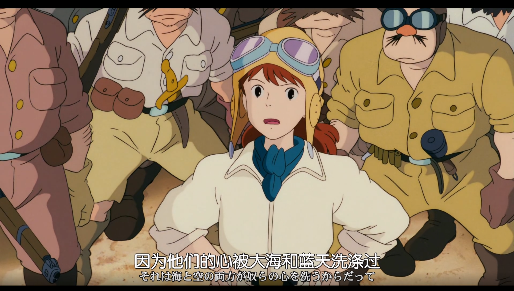

## 印象深刻的场景

极致的浪漫！大海，天空，白云，飞艇。

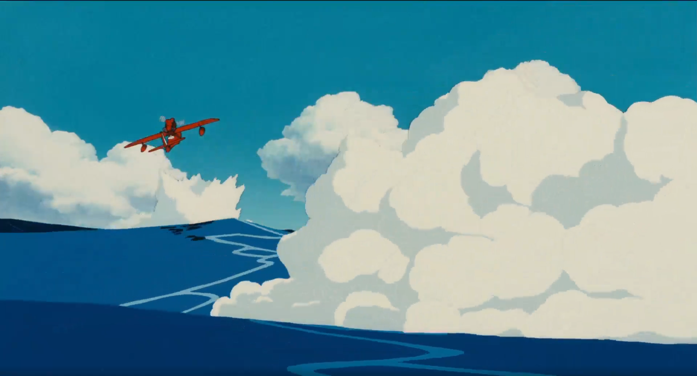

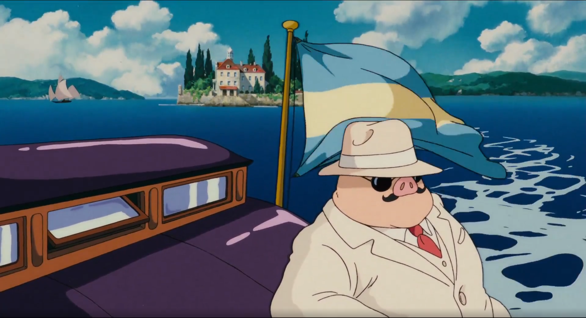

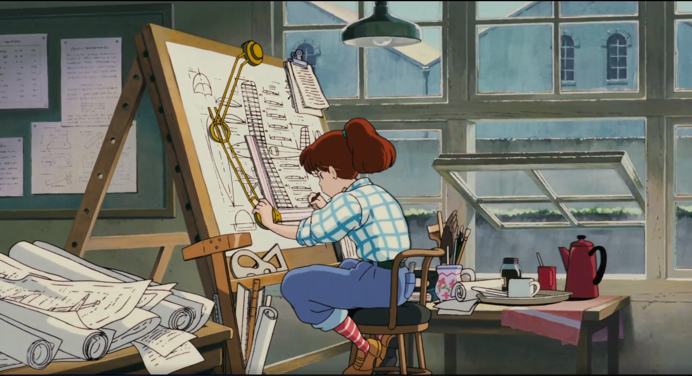

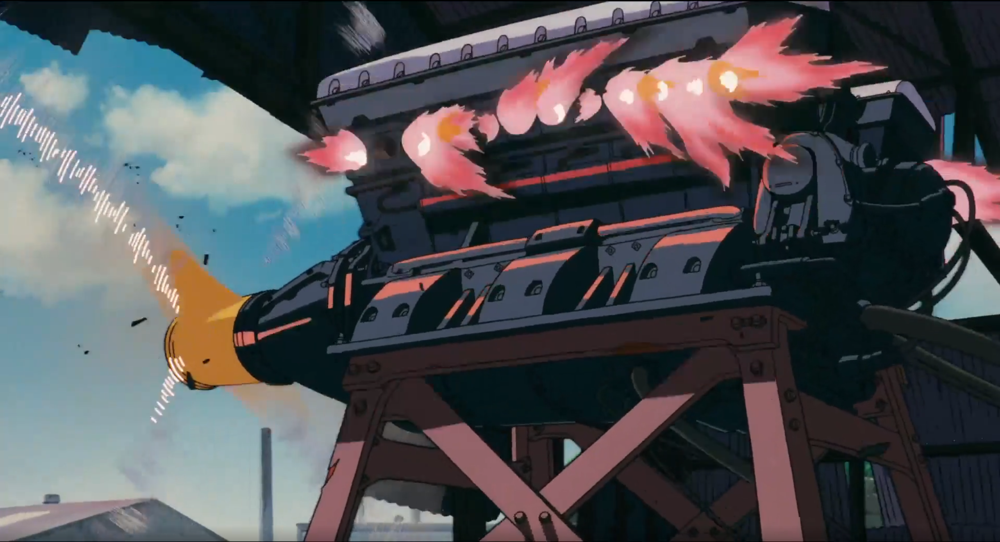

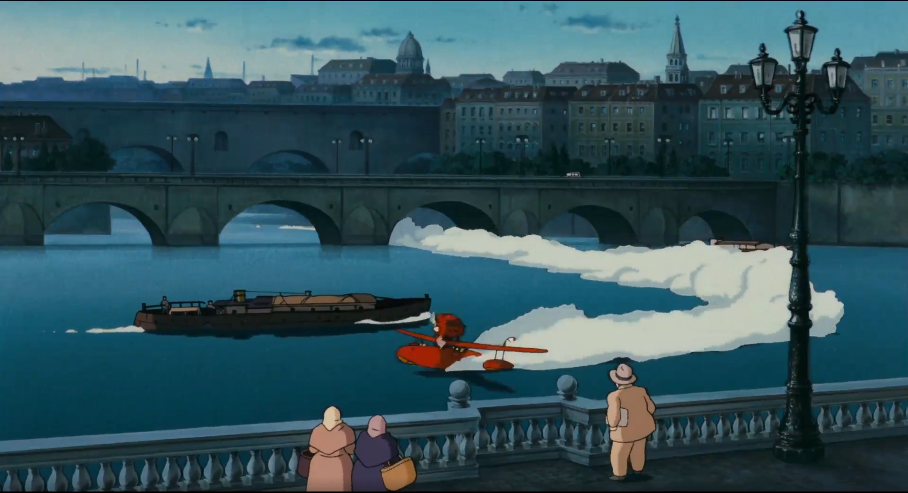

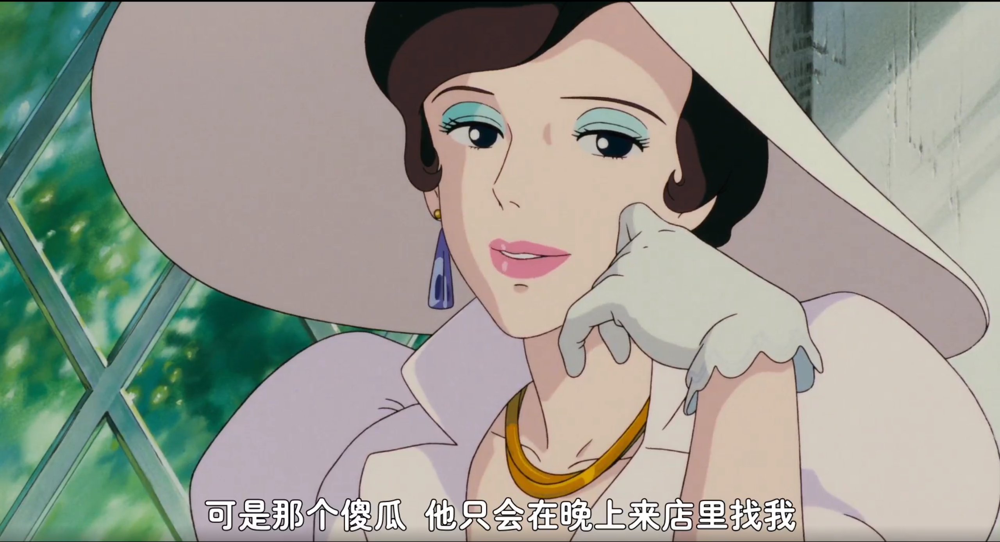

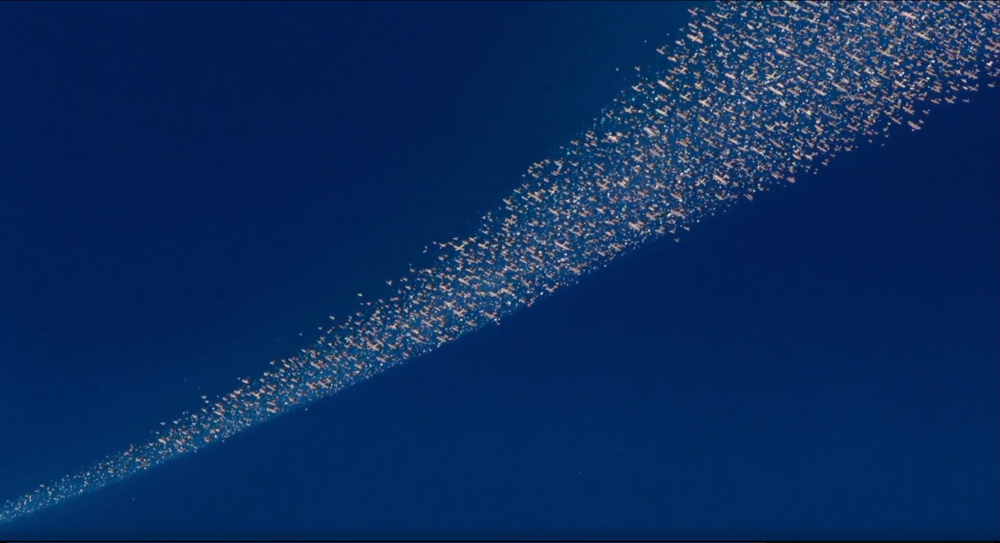

## 为什么是猪？

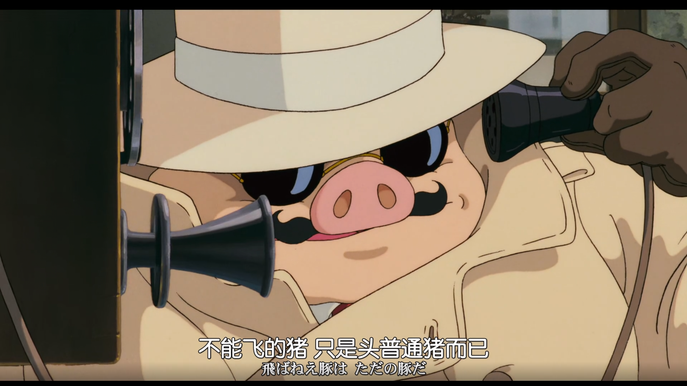

主人公为什么会变成猪。猪是懒惰，散漫又毫无责任感的象征。主人公正是被时代/政府视作懒散不负责任，因为在那个经济低迷，战火和冲突纷发的年代，个人唯有将其全部价值奉献给民族和国家，才是时代/政府眼中负责任的做法，主人公作为原空军本领高强的飞行高手，却不为国家出力，而是隐居荒岛靠赏金为生，**因此才被时代/政府定义成猪**。

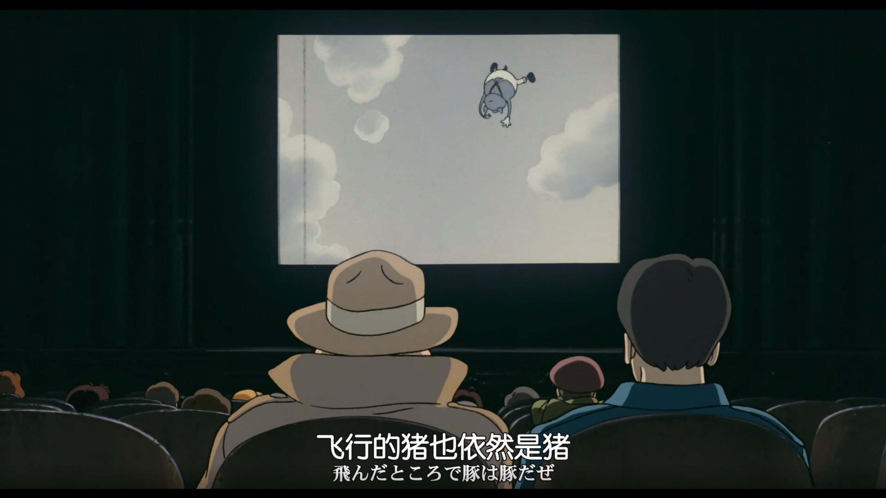

但懒惰，散漫和毫无责任感这些词语的背后，正是宝贵的自由。自由地在大海和蓝天之中遨游，自由地追求和捍卫飞行员的荣耀，不受国家和法律的约束，不必与他人自相残杀，不必眼睁睁而又无可奈何地看着昔日的战友死去。需要牵挂的，只有一位老朋友，做自由的游侠，也并不耽误每晚酒会与老友的会面。可以说，**主人公是自愿变成“猪”的**。

但自由有其代价，红猪所选择的自由之路是终究不会被时代和政府承认的。卖汽油店里的老人对主人公说靠他的能力加入组织中一定能赚大钱；军队中的旧识也希望主人公能重归部队，至少在部队中有人脉可以保护他。但红猪知道自己要走什么路，也知道自己的路如何凶险和艰难。这也是为何他坚决不让机械师小姐跟随自己踏上自己的道路；对心上人吉娜也始终以敬爱的朋友之情相对，尽管从宿敌卡吉士口中了解到吉娜对自己的心意，在这个无法给予心上人幸福保证的时代，主人公也无法轻易地迈出这一步。

幸运的是，当时代悄然改变，能够宽容自由之日，那主人公也就不会再是猪的形态。结尾红色的机翼，吉娜并不在白天的私人花园，似乎暗示着红猪不同以往的结局。**祝福他们，并向浪漫和自由致敬！**

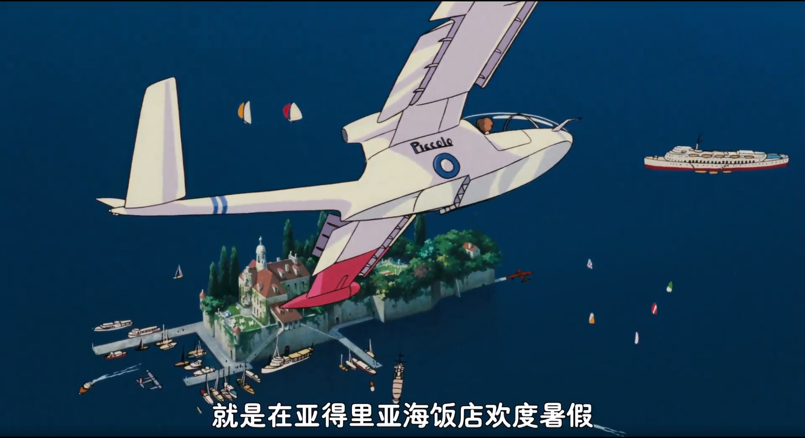

另外，对于来自美国的卡吉士其人，也并非穷凶极恶的反派，反而也是同样追求着自由，荣耀，爱情，甚至带些天真和傻气。吉娜之言“你没有经历过我们所经历的”。没有沉重的包袱，反而能飞的更高更远，最终与红猪也几乎不分胜负。但没有经历与成长，无法成为真正的男人，也是为何他被吉娜拒绝：“请你自己去好莱坞吧，小男孩”，也是为什么红猪能最终走入吉娜心中。