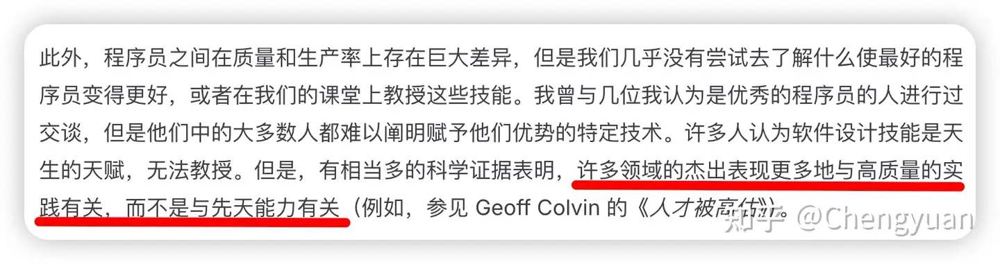

<!--more-->

最近在思考一个问题：为什么总感觉自身的技术能力提升缓慢，但组里的大腿（H神）技术能力成长就快，而且本身技术能力就强。进而在思考，总觉得前十年进入计算机行业的人，基础要比现在的计算机专业同学基础更加扎实。

恰好阅读了《软件设计哲学》，前言里的一段话给了我启发：

可以这么解释，前十年计算机市场化过程中提供了大量高质量实践机。一开始大家可以做的很糙，但是业务也能跑起来，然后再逐步精进。现在各种工具还有门类逐渐专业化，大家只能搞一个很小的点，就实践不起来了。

那“造一点轮子”呢？跟我讨论的同学问我。现在想造一点能解决实际问题的轮子太难了，只能搞出来玩具。

“是因为问题变难了吗？”。我觉得是因为现成的牛逼轮子太多了。

感觉错过了计算机职业发展的黄金时期。如果想精进还是得有更多热情和动力，在闲暇时间多搞点东西。换句话说，对人的要求变高了。

回看组里的H神。他本科时就完整的做过OS项目，也是学校OS教学项目主要的贡献者。且为组里安全项目贡献了完整的Libarary。由于很能干，还被老板派去做MC的开发和验证。最近组里一位博士师兄在调虚网卡相关的问题，H神也来帮忙，亲自试了一把相关debug的技术栈，是因为他觉得过段时间可能让他搞MC驱动，提前适应一下。

可以看到，H神本身技术能力强，同时也不错过任何实践的机会。偶尔也见过他因为工作量和内容发过牢骚，但是对学习各种技术始终抱持热情。跟H神相处过程中，并没有觉得他是某种杰出天才，他偶尔也会犯错。所以想法设法地去实践，去解决真实问题，慢慢积累的实践最终会回馈给你能力的提升。

> 本文原载于[知乎](https://zhuanlan.zhihu.com/p/1921165764238504994)
